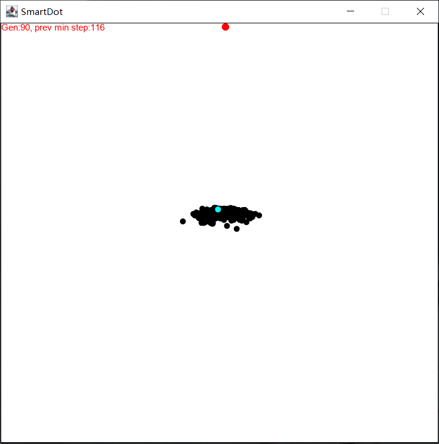
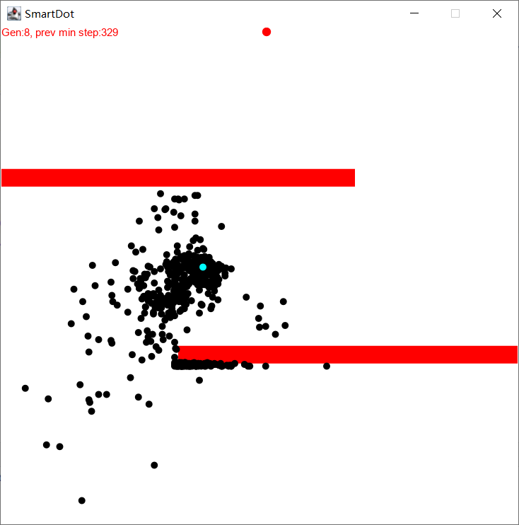
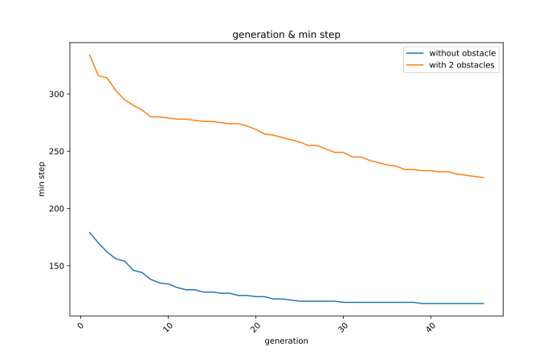

#### Attention
**The problem is to figure out the max or min value of the function, I'm misunderstanding the problem, please click [MaxFunVal](https://github.com/huangyebiaoke/MaxFunVal)**
#### Project Name
**SmartDot**
#### Description
This project is the homework of AI course. Mainly use **Genetic Algorithm** to achieve a game called **smart dot**.

#### Demonstration1(without obstacle)

#### Demonstration2(with 2 obstacles)

#### Summary

From the above picture we can know that with obstacles the min-step would be more high, but the descend rate is similar.
#### Reference
Processing version click [here](https://github.com/Code-Bullet/Smart-Dots-Genetic-Algorithm-Tutorial)